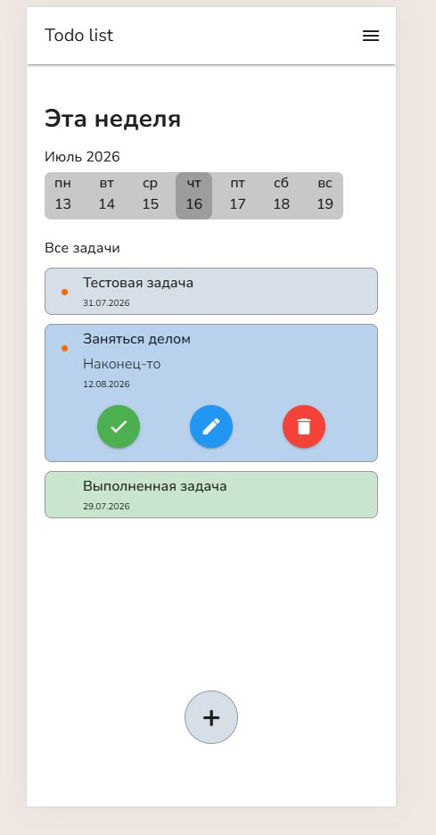
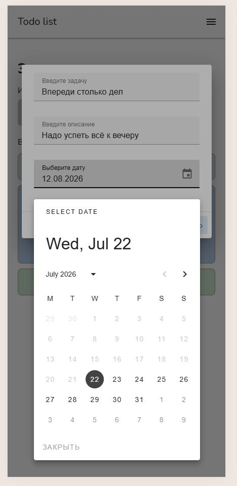
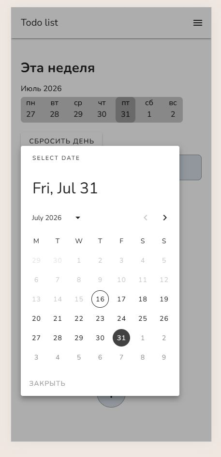

# Task Manager

A Task Manager SPA built with Vue 3 and TypeScript.

This project was developed to practice modern frontend development using Vue 3, TypeScript and related technologies.

## About the Project

This project started as a simple task manager and gradually evolved while I was learning modern frontend development.

During development I migrated the project to TypeScript, integrated Firebase Realtime Database, improved the project structure and continue expand it with new features.

## 🌐 Live Demo

👉 [Open Live Demo](https://to-do-list-git-main-dendru-s-projects.vercel.app/)

## Screenshots

<p align='center'>
  
   &nbsp;
  
   &nbsp;
  
</p>

## Features

- Create, edit and delete tasks
- Mark tasks as completed
- Integrated calendar
- Task filtering
- Task sorting
- Responsive interface
- Firebase Realtime Database integration

## Tech Stack

- Vue 3 (Composition API)
- TypeScript
- Pinia
- Vuetify
- Firebase Realtime Database
- Vite

## 🚀 Getting Started

Clone the repository

```bash
git clone https://github.com/Dendru/to-do-list.git
```

Go to the project directory

```bash
cd to-do-list
```

Install dependencies

```bash
npm install
```

Run the development server

```bash
npm run dev
```

## Future improvements

- Add Firebase Authentication
- Add unit and component tests
- Add PWA support
- Improve UI/UX

## Author

Denis Dobrynin

GitHub: [Dendru] https://github.com/Dendru
